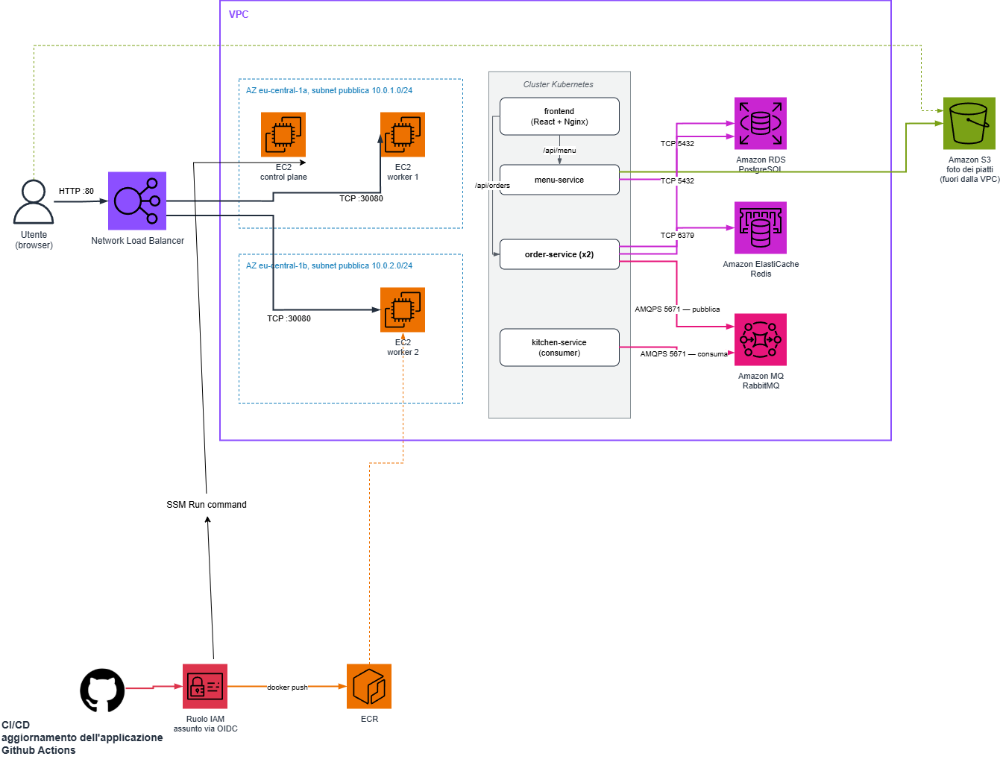

# Cloud Mensa — versione AWS

Questa è la seconda parte del progetto di Sistemi Cloud: la stessa applicazione
della mensa universitaria, ma portata su AWS. La versione locale (Multipass +
kubeadm) si trova qui: https://github.com/vitomarino02-del/Cloud-Mensa

La cosa che interessava dimostrare è che **il codice dell'applicazione non è
cambiato molto **. Tutta la configurazione arriva dall'ambiente, quindi per
passare dal cluster sul portatile ad AWS è bastato cambiare le variabili:
`DATABASE_URL` ora punta a RDS invece che al pod postgres, `STORAGE_BACKEND`
passa da `local` a `s3` e il codice boto3 che era presente in fase 1 (e li non era utilizzato) inizia qui a scrivere su un bucket vero.



## Com'è fatta

Il cluster Kubernetes gira su tre istanze EC2 — una control plane e due worker —
montate con kubeadm tramite Ansible. Ho preferito questa strada a EKS in quanto costa
 meno e mi permette di riusare quasi identico il playbook della Fase 1, ed è
esplicitamente indicata come alternativa nella traccia. Davanti c'è un Network
Load Balancer che raccoglie il traffico e lo inoltra alla NodePort 30080 dei
worker, cosi che l'app abbia un indirizzo pubblico senza dover esporre i nodi.

I tre container di appoggio che in locale si trovavano dentro il cluster sono diventati
servizi gestiti: PostgreSQL è su **RDS**, Redis su **ElastiCache**, RabbitMQ su
**Amazon MQ**. Le foto dei piatti finiscono su **S3** invece che su un volume, e
le immagini Docker su **ECR**. Sparisce quindi lo script che in locale
copiava i tar dentro le VM, perché adesso i nodi fanno il pull autonomamente.

## NOTA
: Un dettaglio su cui ho perso un po' di tempo: Amazon MQ parla AMQPS su TLS, porta
5671, non 5672 in chiaro come RabbitMQ in locale. Fortunatamente `pika` gestisce
`amqps://` senza modifiche, quindi è bastato cambiare la stringa di connessione.

## Le password

Non c'è nessuna credenziale nel repository, ed è una cosa a cui ho fatto
attenzione fin dall'inizio. Le password sono generate da Terraform (`random_password`),
poi le scrive cifrate su **SSM Parameter Store** insieme agli endpoint. Quando
lancio `deploy.sh`, lo script le rilegge da lì e crea il Secret di Kubernetes al
volo. Anche lo stato di Terraform — che le contiene in chiaro — non è versionato:
sta su S3, cifrato, con una tabella DynamoDB che fa da lock per evitare due
`apply` in contemporanea.

Discorso simile per S3: il menu-service ci scrive sopra senza avere nessuna chiave
AWS, perché le istanze hanno un ruolo IAM e boto3 recupera credenziali temporanee
dal metadata service.

## Struttura

```
main.tf              rete, EC2, NLB, RDS, ElastiCache, Amazon MQ, S3, ECR, IAM, SSM
ansible/site.yml     installazione del cluster kubeadm sulle istanze
k8s/                 manifest dell'app (immagini da ECR, ConfigMap + Secret)
push-ecr.sh          build e push delle immagini
deploy.sh            legge i segreti da SSM e applica i manifest
up.sh / down.sh      avvio completo dell'ambiente e teardown (piano B)
.github/workflows/   pipeline CI/CD: infra.yml, deploy.yml, destroy.yml
CICD-GITHUB.md       guida alle pipeline (ruolo IAM, secret, approvazione)
menu-service/  order-service/  kitchen-service/  frontend/
```

## Come si avvia per la prima volta

Servono AWS CLI configurata, Terraform, Ansible, kubectl, Docker e una chiave SSH
in `~/.ssh/id_rsa`. 

Il backend dello stato va creato a mano una volta sola, prima del primo `init`
(Terraform non può creare il bucket in cui
salverà il proprio stato):

```
aws s3api create-bucket --bucket mensa-tfstate-<ACCOUNT_ID> --region eu-central-1 \
  --create-bucket-configuration LocationConstraint=eu-central-1
aws dynamodb create-table --table-name mensa-tfstate-lock \
  --attribute-definitions AttributeName=LockID,AttributeType=S \
  --key-schema AttributeName=LockID,KeyType=HASH \
  --billing-mode PAY_PER_REQUEST --region eu-central-1
```

Fatto quello, il resto lo fanno le pipeline.

## Pipeline CI/CD (GitHub Actions)


| Pipeline | Quando parte | Cosa fa |
|---|---|---|
| `infra.yml` | push o pull request su `main.tf` / `ansible/**` (o a mano) | **plan** (sulla PR diventa un commento) → **provision**, che aspetta la mia approvazione → **configure**: Ansible monta il cluster, il kubeconfig va cifrato su SSM, primo deploy e foto |
| `deploy.yml` | push sui servizi o su `k8s/**` (o a mano) | build e push su ECR con tag = SHA del commit, kubeconfig letto da SSM, `kubectl apply`, attesa del rollout |
| `destroy.yml` | solo a mano, con approvazione | cancella il kubeconfig da SSM e fa `terraform destroy` |

GitHub entra in AWS con **OIDC**: nei secret c'è solo l'ARN del ruolo
(`AWS_ROLE_ARN`), più le due chiavi SSH. Nessuna chiave AWS salvata da nessuna parte;
le credenziali durano un'ora.

Il ruolo IAM della pipeline si crea **a mano dalla console**, come nel laboratorio, e
non sta in `main.tf`: la pipeline fa anche `destroy` e non deve poter cancellare il
ruolo con cui si autentica. I blocchi `removed` in fondo a `main.tf` lo tolgono dallo
stato senza cancellarlo (serve Terraform ≥ 1.7). La procedura completa è in
[CICD-GITHUB.md](CICD-GITHUB.md).

L'approvazione manuale si ottiene con l'environment `production`
(Settings → Environments → Required reviewers).

## Come si avvia con le pipeline, passo passo

La procedura completa (con le policy IAM) è in [CICD-GITHUB.md](CICD-GITHUB.md).

### A. Preparazione (una volta sola)

1. **Backend dello stato**: bucket S3 e tabella DynamoDB, con i comandi della sezione
   precedente.
2. **Ruolo IAM per GitHub**, dalla console AWS (come nel laboratorio):
   - *IAM → Identity providers → Add provider*: OpenID Connect,
     URL `https://token.actions.githubusercontent.com`, audience `sts.amazonaws.com`
     (se non esiste già);
   - *IAM → Roles*: ruolo `mensa-github-actions` di tipo *Web identity* per il repo
     `vitomarino02-del/Cloud-Mensa-AWS-Version`;
   - policy: `AmazonEC2FullAccess`, `AmazonS3FullAccess`, `AmazonDynamoDBFullAccess`,
     `AmazonSSMFullAccess`, `AmazonRDSFullAccess`, `AmazonElastiCacheFullAccess`,
     `AmazonMQFullAccess`, `AmazonEC2ContainerRegistryFullAccess`, più la policy inline
     per il ruolo dei nodi indicata in CICD-GITHUB.md.
3. **Secret del repository** (*Settings → Secrets and variables → Actions*):
   - `AWS_ROLE_ARN` = `arn:aws:iam::862087104689:role/mensa-github-actions`
   - `SSH_PRIVATE_KEY` = contenuto di `~/.ssh/id_rsa`
   - `SSH_PUBLIC_KEY` = contenuto di `~/.ssh/id_rsa.pub`
   (la stessa chiave del PC, altrimenti Terraform ricrea key pair e istanze).
4. **Approvazione manuale**: *Settings → Environments → New environment* `production`,
   con il proprio utente in *Required reviewers*.
5. **Terraform ≥ 1.7** sul PC (`terraform version`), per i blocchi `removed`.

### B. Avvio (ogni volta)

1. Su GitHub: *Actions → **Provision K8s Cluster on AWS** → Run workflow → main*
   (oppure un push o una pull request che modifica `main.tf` o `ansible/`).
2. Il job **plan** mostra cosa verrà creato. Il job **provision** si ferma in attesa:
   *Review deployments → production → Approve and deploy*.
3. Attendere: RDS richiede fino a 30 minuti, Amazon MQ circa 10.
   Poi il job **configure** monta il cluster, salva il kubeconfig su SSM, pubblica le
   immagini, fa il primo deploy e carica le foto.
4. **URL dell'app**: nel riepilogo del job *configure* (oppure `terraform output app_url`).
5. **kubectl dal PC** (facoltativo):
   ```bash
   aws ssm get-parameter --region eu-central-1 --name /mensa/kubeconfig \
     --with-decryption --query Parameter.Value --output text > ~/mensa-aws-kubeconfig
   chmod 600 ~/mensa-aws-kubeconfig
   KUBECONFIG=~/mensa-aws-kubeconfig kubectl get nodes
   KUBECONFIG=~/mensa-aws-kubeconfig kubectl -n mensa get pods,deploy -o wide
   ```
6. **Aggiornare l'app**: modifica a un servizio, commit e `git push origin main` →
   parte da solo *Deploy to Kubernetes*. Rollback: `git revert HEAD --no-edit && git push`.

### C. Spegnimento

*Actions → **Destroy AWS** → Run workflow → main*, poi approvare `production`.
Alla fine il job elenca le istanze ancora accese (deve essere vuoto).
Il ruolo IAM, il bucket dello stato e la tabella di lock restano: costano pochi centesimi.

### Insieme alla versione locale

Le due versioni possono girare contemporaneamente (repo, stato, registry e cluster
separati). Conviene avviare prima questa, perché è la più lenta, e usare due kubeconfig
distinti: `~/mensa-aws-kubeconfig` per AWS e `~/mensa-kubeconfig` per il locale.

## Avvio a mano (piano B, versione vecchia del progetto)

Se serve, tutto si può ancora fare dal PC con uno script:

```
bash up.sh
```

Crea l'infrastruttura, monta il cluster con Ansible, salva il kubeconfig su SSM (così
la pipeline di deploy funziona anche dopo un avvio manuale), costruisce e carica le
immagini su ECR, deploya l'applicazione e carica le foto dei piatti. Alla fine stampa
l'URL del load balancer. Per spegnere tutto e azzerare la spesa: `bash down.sh`.

Terraform genera da solo l'inventory di Ansible con gli IP delle istanze, quindi
non c'è niente da copiare a mano fra un passaggio e l'altro.

Avviso sui tempi: RDS ci ha messo circa 30 minuti a nascere e Amazon MQ circa 10 minuti, quindi `up.sh` va lanciato con attenzione.

Per aggiornare l'applicazione basta un push su main: ci pensa `deploy.yml`.
Per un rollback: `git revert` e push.

## Cose scoperte strada facendo

**mq.t3.micro non esiste più per RabbitMQ.** Amazon MQ lo supporta solo con
ActiveMQ; per RabbitMQ il taglio più piccolo disponibile è `mq.m7g.medium`, che
costa comunque un decimo di `m5.large`. Il primo `apply` è fallito proprio lì.

**Niente NAT Gateway.** Costa circa 30 $ al mese fissi e per questo
progetto non serve: i nodi stanno in subnet pubbliche e sono protetti dai security
group.

**SSH e API server aperti.** All'inizio le porte 22 e 6443 erano aperte solo al mio
IP e il deploy passava da SSM Run Command, eseguendo `kubectl` direttamente sul
control plane. Per allinearmi al laboratorio ora sono aperte come in
`github-actions-aws`: i runner di GitHub hanno IP sempre diversi e devono raggiungere
i nodi con Ansible e `kubectl`. La protezione resta nella chiave SSH (niente password)
e nei certificati del kubeconfig, che sta cifrato su SSM e non nel repo. La versione
con Run Command resta l'alternativa più restrittiva.

**Il token di ECR dura 12 ore.** Il Secret `ecr-creds` che permette a Kubernetes
di scaricare le immagini va rigenerato: lo fa la pipeline `deploy.yml` a ogni esecuzione (a mano basta
rilanciare `deploy.sh`). In
produzione si userebbe il credential provider di AWS, o direttamente EKS che se ne
occupa da solo: qui ho preferito la soluzione semplice e documentarne il limite.

**Il certificato dell'API server.** Il control plane pubblicizza l'IP privato per
parlare con i nodi, ma per usare `kubectl` dal mio PC serve che il certificato
includa anche quello pubblico — da cui il flag `--apiserver-cert-extra-sans` nel
playbook, e la riscrittura del kubeconfig scaricato.

## Costi

Con tutto acceso siamo sui pochi euro al giorno. `terraform destroy` smonta ogni
cosa e riporta la spesa a zero; restano solo il bucket dello stato e la tabella di
lock, che costano frazioni di centesimo. Quando riprendo, `terraform apply` ricrea
l'infrastruttura in qualche minuto — poi vanno rifatti il playbook Ansible e il
deploy, perché le istanze sono nuove.
